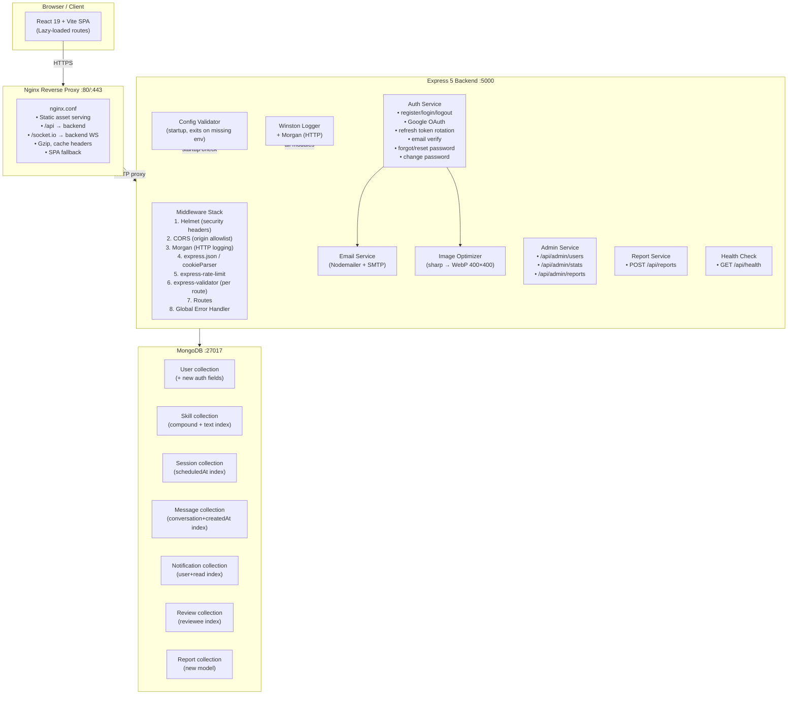
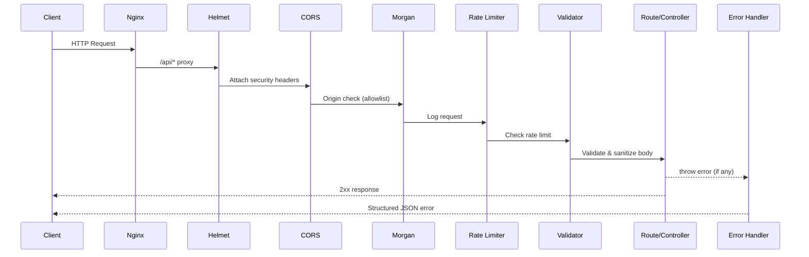
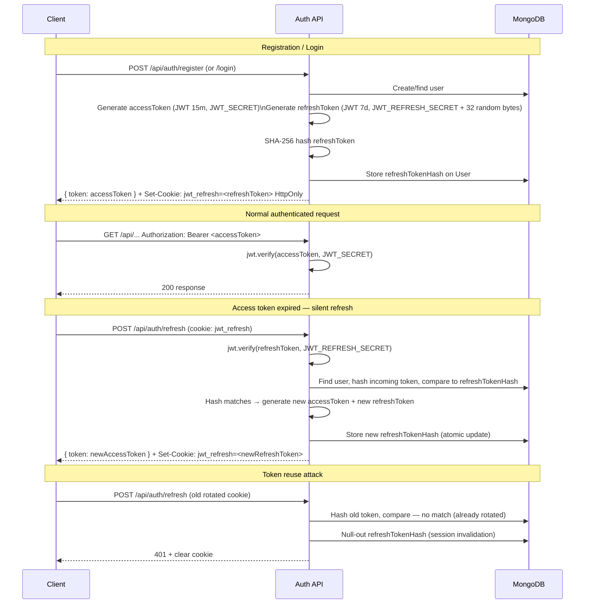

# Design Document — production-launch-hardening

## Overview

This document describes the technical design for hardening SkillSwap for a production launch. The work touches every layer of the stack: security middleware, authentication flows, transactional email, infrastructure packaging, frontend performance, and admin tooling. The goal is a deployable, observable, secure, and maintainable application ready for real users.

The design is organized around these themes:

1. **Security** — Helmet.js, CORS lockdown, input validation, global error handling
2. **Auth flows** — refresh token rotation with hash storage, email verification, forgot/reset password, welcome emails, password change
3. **Infrastructure** — environment validation, health check, structured logging, MongoDB indexes, image optimization
4. **Deployment** — Docker + Compose, Nginx reverse proxy
5. **Frontend** — lazy loading, new auth pages, admin route guard
6. **Admin / Trust** — admin dashboard API, abuse report feature

---

## Architecture

### System Component Diagram



### Request Lifecycle



---

## Components and Interfaces

### Backend Middleware Stack (ordered)

The ordering in `server.js` is critical. New order:

```
1.  Config Validator (synchronous, before server.listen)
2.  helmet()                          ← security headers
3.  cors(corsOptions)                 ← allowlist-based CORS
4.  morgan(format, { stream })        ← HTTP access logging
5.  express.json({ limit: '10mb' })
6.  express.urlencoded({ extended: true })
7.  cookieParser()
8.  express.static('/uploads')
9.  Route-level: express-validator chains (per endpoint)
10. Route handlers (controllers)
11. globalErrorHandler()              ← LAST middleware
```

### New Backend Modules

| Module | Path | Responsibility |
|---|---|---|
| `validateEnv` | `config/validateEnv.js` | Startup env var validation; calls `process.exit(1)` |
| `logger` | `utils/logger.js` | Winston instance (JSON in prod, colorized in dev) |
| `emailService` | `services/emailService.js` | Nodemailer transporter + template functions |
| `imageOptimizer` | `utils/imageOptimizer.js` | sharp pipeline: resize 400×400, WebP quality 80 |
| `corsOptions` | `config/corsOptions.js` | Parses `ALLOWED_ORIGINS`, returns cors middleware config |
| `globalErrorHandler` | `middleware/errorHandler.js` | Catches all errors, formats response, logs via Winston |
| `adminMiddleware` | `middleware/adminMiddleware.js` | Checks `req.user.role === 'admin'`, else 403 |
| `validators/auth` | `validators/authValidators.js` | express-validator chains for auth routes |
| `validators/report` | `validators/reportValidators.js` | express-validator chain for POST /api/reports |

### New Backend Routes/Controllers

| Route | Controller | Auth |
|---|---|---|
| `GET /api/health` | `healthController.js` | Public |
| `GET /api/auth/verify-email` | `authController.js` | Public |
| `POST /api/auth/resend-verification` | `authController.js` | Public (rate-limited) |
| `POST /api/auth/forgot-password` | `authController.js` | Public (rate-limited) |
| `POST /api/auth/reset-password` | `authController.js` | Public |
| `PUT /api/auth/change-password` | `authController.js` | Protected |
| `POST /api/reports` | `reportController.js` | Protected |
| `GET /api/admin/users` | `adminController.js` | Admin |
| `PATCH /api/admin/users/:id/status` | `adminController.js` | Admin |
| `GET /api/admin/stats` | `adminController.js` | Admin |
| `GET /api/admin/reports` | `adminController.js` | Admin |
| `PATCH /api/admin/reports/:id` | `adminController.js` | Admin |

### Frontend New Pages and Components

| Component | Path | Description |
|---|---|---|
| `ForgotPassword` | `pages/ForgotPassword.jsx` | Form to request password reset email |
| `ResetPassword` | `pages/ResetPassword.jsx` | Form to submit new password using URL token |
| `VerifyEmail` | `pages/VerifyEmail.jsx` | Landing page for email verification link |
| `AdminDashboard` | `pages/AdminDashboard.jsx` | Admin-only dashboard with user list and reports |
| `AdminRoute` | `components/AdminRoute.jsx` | HOC that redirects non-admin users to `/dashboard` |

---

## Data Models

### Updated User Schema

The existing `User` model gains these fields:

```js
// Auth / security fields
emailVerified:            { type: Boolean, default: false }
emailVerificationToken:   { type: String, default: null }   // SHA-256 hash
emailVerificationExpiry:  { type: Date,   default: null }

passwordResetToken:       { type: String, default: null }   // SHA-256 hash
passwordResetExpiry:      { type: Date,   default: null }

refreshTokenHash:         { type: String, default: null }   // SHA-256 hash

// Account management
isActive:  { type: Boolean, default: true }
role:      { type: String, enum: ['user', 'admin'], default: 'user' }
```

No existing fields are removed. The `password` field remains required (Google OAuth users get a random password at creation, existing behavior unchanged).

Index additions to User model:
```js
userSchema.index({ email: 1 }, { unique: true });  // already unique: true on field, make explicit
```

### Report Model (new)

```js
// models/Report.js
const reportSchema = mongoose.Schema({
  reporterId:     { type: ObjectId, required: true, ref: 'User' }
  reportedUserId: { type: ObjectId, required: true, ref: 'User' }
  reason:         { type: String, required: true,
                    enum: ['spam','harassment','inappropriate_content','fake_profile','other'] }
  details:        { type: String, maxlength: 500, default: '' }
  status:         { type: String, enum: ['open','resolved','dismissed'], default: 'open' }
  resolvedBy:     { type: ObjectId, ref: 'User', default: null }
  resolvedAt:     { type: Date, default: null }
}, { timestamps: true })

reportSchema.index({ status: 1, createdAt: -1 })
reportSchema.index({ reportedUserId: 1 })
```

### Index Additions to Existing Models

```js
// Skill model
skillSchema.index({ user: 1, type: 1 })
skillSchema.index({ name: 'text', category: 'text' })

// Session model
sessionSchema.index({ participants: 1 })   // participants = [mentor, learner] virtual or query on both
sessionSchema.index({ scheduledAt: 1 })

// Message model
messageSchema.index({ conversation: 1, createdAt: 1 })

// Notification model
notificationSchema.index({ user: 1, read: 1 })

// Review model
reviewSchema.index({ reviewee: 1 })
```

---

## Email Service Design

### Nodemailer Transporter Configuration

```js
// services/emailService.js
import nodemailer from 'nodemailer'
import logger from '../utils/logger.js'

const transporter = nodemailer.createTransport({
  host:   process.env.EMAIL_HOST,
  port:   Number(process.env.EMAIL_PORT),
  secure: Number(process.env.EMAIL_PORT) === 465,
  auth: {
    user: process.env.EMAIL_USER,
    pass: process.env.EMAIL_PASS,
  },
  connectionTimeout: 10_000,   // 10 s
  greetingTimeout:   10_000,
})
```

The transporter is created once at module load. All send functions are async and wrapped in try/catch; errors are logged at `warn` and do not propagate to callers.

### Email Template Functions

| Function | Trigger | Contents |
|---|---|---|
| `sendVerificationEmail(user, token)` | Register | Verify link with 24h token |
| `sendWelcomeEmail(user)` | Register / Google OAuth | Name, home URL, profile CTA |
| `sendPasswordResetEmail(user, token)` | Forgot password | Reset link with 1h token |
| `sendPasswordResetConfirmEmail(user)` | Reset password success | Confirmation notice |

All functions construct HTML using template literals. The verify/reset URLs are constructed as:
```
${process.env.FRONTEND_URL}/verify-email?token=<plaintextToken>
${process.env.FRONTEND_URL}/reset-password?token=<plaintextToken>
```

Token generation and hashing pattern (used for both email verification and password reset):
```js
import crypto from 'crypto'

// Generate
const plainToken = crypto.randomBytes(32).toString('hex')
const hashedToken = crypto.createHash('sha256').update(plainToken).digest('hex')

// Store hashedToken on User document
// Send plainToken in the email URL
// On receipt, hash the incoming token and compare to stored hash
```

---

## Token and Auth Flow Design

### Access + Refresh Token Lifecycle



### Key Design Decisions

**Separate JWT secrets**: `JWT_SECRET` for access tokens and `JWT_REFRESH_SECRET` for refresh tokens. Using a separate secret means a compromised access token cannot be used to forge refresh tokens.

**Randomness in refresh token**: The refresh JWT payload includes `jti: crypto.randomBytes(32).toString('hex')`. This means even if the JWT signature is somehow broken, the random jti is required to match the hash in the DB, providing defense-in-depth.

**SHA-256 hash storage**: Never store the plaintext refresh token. An attacker who reads the DB cannot use the stored hash to craft a valid cookie.

**Atomic rotation**: The DB update uses `findOneAndUpdate` with a query filter that includes the current `refreshTokenHash`. If the token was already rotated between the verify step and the write step (race condition), the update finds no document and returns null, which is treated as a reuse attempt.

---

## Frontend Architecture Changes

### Lazy Loading Implementation

`App.jsx` will be refactored to use `React.lazy` + `React.Suspense`:

```jsx
// Before (eager)
import Dashboard from './pages/Dashboard'

// After (lazy)
const Dashboard = React.lazy(() => import('./pages/Dashboard'))
```

All eight page-level routes are converted: `Dashboard`, `Explore`, `Profile`, `Sessions`, `Chat`, `VideoCall`, `Leaderboard`, `Community`. The new pages (`ForgotPassword`, `ResetPassword`, `VerifyEmail`, `AdminDashboard`) are also lazy-loaded from the start.

A single `<Suspense>` boundary wraps the `<Routes>` block:

```jsx
<Suspense fallback={<PageLoader />}>
  <Routes>
    {/* ... all routes ... */}
  </Routes>
</Suspense>
```

`PageLoader` is a simple full-screen centered spinner component.

### Route Hover Preloading

Navigation links use `onMouseEnter` to trigger preload 100ms after hover begins:

```jsx
// Inside Navbar, for each nav link:
const handleHoverStart = (importFn) => {
  hoverTimer.current = setTimeout(() => importFn(), 100)
}
const handleHoverEnd = () => clearTimeout(hoverTimer.current)

// The import fn is e.g.: () => import('./pages/Dashboard')
```

The dynamic `import()` called during hover is the same module import that `React.lazy` uses, so Vite/webpack will serve the already-cached chunk on navigation.

### Admin Route Guard

```jsx
// components/AdminRoute.jsx
import { Navigate } from 'react-router-dom'
import { useAuthStore } from '../store/authStore'

export default function AdminRoute({ children }) {
  const { user } = useAuthStore()
  if (!user) return <Navigate to="/login" replace />
  if (user.role !== 'admin') return <Navigate to="/dashboard" replace />
  return children
}
```

Used in `App.jsx`:
```jsx
<Route path="/admin" element={
  <AdminRoute>
    <AdminDashboard />
  </AdminRoute>
} />
```

### New Frontend Routes

```
/forgot-password    → <ForgotPassword>
/reset-password     → <ResetPassword>   (reads ?token= from URL)
/verify-email       → <VerifyEmail>     (reads ?token= from URL, calls API on mount)
/admin              → <AdminRoute><AdminDashboard></AdminRoute>
```

### Auth Store Updates

The `authStore` needs two additions:
- `role` field stored in the user object (returned by login/register endpoints)
- `isActive` check: if a refresh returns 403 "account deactivated", call `logout()` automatically

---

## Docker and Infrastructure Design

### Backend Dockerfile

```dockerfile
# backend/Dockerfile
FROM node:20-alpine AS base

WORKDIR /app

# Install production deps only
COPY package*.json ./
RUN npm ci --omit=dev

# Copy source
COPY . .

# Non-root user (node user already exists in node:alpine, uid 1000)
USER node

EXPOSE 5000
CMD ["node", "server.js"]
```

### Frontend Dockerfile (multi-stage)

```dockerfile
# frontend/Dockerfile
# Stage 1: Build
FROM node:20-alpine AS builder

WORKDIR /app
COPY package*.json ./
RUN npm ci
COPY . .
RUN npm run build

# Stage 2: Serve
FROM nginx:alpine AS production

COPY --from=builder /app/dist /usr/share/nginx/html
COPY nginx.conf /etc/nginx/conf.d/default.conf

EXPOSE 80
CMD ["nginx", "-g", "daemon off;"]
```

### docker-compose.yml

```yaml
version: '3.9'

services:
  mongodb:
    image: mongo:7
    volumes:
      - mongo_data:/data/db
    restart: unless-stopped
    networks:
      - app-network

  backend:
    build:
      context: ./backend
      dockerfile: Dockerfile
    env_file: ./backend/.env
    depends_on:
      - mongodb
    ports:
      - "5000:5000"
    restart: unless-stopped
    networks:
      - app-network

  frontend:
    build:
      context: ./frontend
      dockerfile: Dockerfile
    ports:
      - "80:80"
    depends_on:
      - backend
    networks:
      - app-network

volumes:
  mongo_data:

networks:
  app-network:
    driver: bridge
```

### Nginx Configuration

```nginx
# nginx.conf
server {
    listen 80;
    server_name _;
    root /usr/share/nginx/html;
    index index.html;

    # Gzip
    gzip on;
    gzip_min_length 1024;
    gzip_types text/html text/css application/javascript application/json;

    # Immutable cache for hashed static assets
    location ~* "\.[0-9a-f]{8,}\.(js|css|woff2?)$" {
        add_header Cache-Control "public, max-age=31536000, immutable";
        try_files $uri =404;
    }

    # API proxy
    location /api/ {
        proxy_pass         http://backend:5000;
        proxy_set_header   Host              $host;
        proxy_set_header   X-Real-IP         $remote_addr;
        proxy_set_header   X-Forwarded-For   $proxy_add_x_forwarded_for;
    }

    # Socket.IO proxy (WebSocket)
    location /socket.io/ {
        proxy_pass         http://backend:5000;
        proxy_http_version 1.1;
        proxy_set_header   Upgrade    $http_upgrade;
        proxy_set_header   Connection "upgrade";
        proxy_set_header   Host       $host;
    }

    # SPA fallback — serve index.html for all unmatched GET requests
    location / {
        try_files $uri $uri/ /index.html;
    }
}
```

---

## Correctness Properties

*A property is a characteristic or behavior that should hold true across all valid executions of a system — essentially, a formal statement about what the system should do. Properties serve as the bridge between human-readable specifications and machine-verifiable correctness guarantees.*

### Property 1: CSP Directive Construction

*For any* list of trusted CDN origin strings (including the empty list), the `Content-Security-Policy` header's `script-src` directive constructed by the CSP builder function SHALL contain exactly `'self'` plus each provided origin — no more, no fewer.

**Validates: Requirements 1.2**

---

### Property 2: CORS Origin Filtering

*For any* non-empty set of allowed origin strings and any origin string not in that set, the CORS middleware SHALL reject the request (deny the response header `Access-Control-Allow-Origin`). Conversely, *for any* origin in the allowed set, the middleware SHALL permit it.

**Validates: Requirements 2.1, 2.2**

---

### Property 3: Validation Error Response Shape

*For any* request to a validated endpoint where one or more fields violate their declared rules, the response SHALL be HTTP 422 and the JSON body SHALL contain an `errors` array where every element has a non-empty `field` string property and a non-empty `message` string property.

**Validates: Requirements 3.4**

---

### Property 4: Email and Password Field Validation

*For any* string that is not a structurally valid RFC 5321 email address, the email validator SHALL reject it. *For any* string that satisfies all three conditions — length between 8 and 72 characters, contains at least one uppercase letter, one lowercase letter, and one digit — the password validator SHALL accept it. *For any* string that violates any single one of those conditions, the validator SHALL reject it.

**Validates: Requirements 3.6, 3.7**

---

### Property 5: HTML Sanitization Invariant

*For any* string input containing one or more HTML tags (e.g. `<script>`, ``, `<b>`) or HTML-encoded entities (e.g. `&lt;`, `&#60;`), the sanitized output stored in the database SHALL contain no HTML tag patterns and no decoded HTML entity sequences.

**Validates: Requirements 3.9**

---

### Property 6: Error Handler Status Code Mapping

*For any* error object passed to the global error handler, the HTTP response status code SHALL equal `error.statusCode` if `error.statusCode` is a finite integer between 400 and 599 inclusive, and SHALL equal 500 otherwise. The response body SHALL always contain an `error` field with a string message.

**Validates: Requirements 4.2**

---

### Property 7: Refresh Token Rotation and Reuse Detection

*For any* user with a currently valid refresh token: (a) after a successful call to `POST /api/auth/refresh`, the old refresh token SHALL be rejected with HTTP 401 on any subsequent call; (b) the new refresh token SHALL be accepted; (c) if the old (already-rotated) refresh token is submitted again, the server SHALL return HTTP 401 AND the stored `refreshTokenHash` on that user's document SHALL be null (session fully revoked).

**Validates: Requirements 5.1, 5.4**

---

### Property 8: Token Expiry Invariant

*For any* cryptographic token (email verification or password reset) created at a given UTC timestamp T with a given TTL (24 hours for verification, 1 hour for reset): the token SHALL be accepted as valid at any time strictly before T + TTL, and SHALL be rejected with HTTP 400 at any time at or after T + TTL.

**Validates: Requirements 6.3, 7.1**

---

### Property 9: Email Verification Round-Trip

*For any* newly registered user who has not yet verified their email, presenting the correct plaintext verification token at `GET /api/auth/verify-email?token=<token>` before it expires SHALL result in that user's `emailVerified` field being set to `true` in the database, and a subsequent call with the same token SHALL be rejected (already used).

**Validates: Requirements 6.4, 6.5**

---

### Property 10: Password Change Pre-Check Invariant

*For any* authenticated user and *any* value of `currentPassword` that does not match the user's stored bcrypt hash, a call to `PUT /api/auth/change-password` SHALL return HTTP 401, and the user's stored password hash in the database SHALL be identical before and after the request.

**Validates: Requirements 9.2, 9.3**

---

### Property 11: Image Resize Dimension Invariant

*For any* uploaded image with arbitrary width W and height H (both ≥ 1 pixel), the optimized output written to disk SHALL have width W' ≤ 400 and height H' ≤ 400. Furthermore, the aspect ratio SHALL be preserved: |W'/H' − W/H| < 0.01.

**Validates: Requirements 14.1, 14.2**

---

### Property 12: Upload MIME Type Rejection

*For any* MIME type string that is not one of `image/jpeg`, `image/png`, `image/webp`, or `image/gif`, a file upload request carrying that MIME type SHALL be rejected with HTTP 415 before any file is written to disk.

**Validates: Requirements 14.5**

---

### Property 13: Admin Pagination Result Count Invariant

*For any* pagination parameters `page` (≥ 1) and `pageSize` (between 1 and 100 inclusive), the `GET /api/admin/users` response SHALL contain at most `pageSize` user objects in its data array, regardless of the total number of users in the database.

**Validates: Requirements 18.2**

---

### Property 14: Report Creation Round-Trip

*For any* valid report submission (valid `reportedUserId`, valid `reason`, authenticated reporter who is not reporting themselves), the created Report document in the database SHALL have: `reporterId` equal to the authenticated user's ID, `reportedUserId` equal to the submitted value, `reason` equal to the submitted value, `status` equal to `"open"`, and `createdAt` within 5 seconds of the request timestamp.

**Validates: Requirements 19.1, 19.2**

---

## Error Handling

### Global Error Handler Structure

```js
// middleware/errorHandler.js
export const globalErrorHandler = (err, req, res, next) => {
  logger.error({
    message: err.message,
    stack: err.stack,
    path: req.path,
    method: req.method,
  })

  // Mongoose ValidationError
  if (err.name === 'ValidationError') {
    return res.status(422).json({
      errors: Object.values(err.errors).map(e => ({
        field: e.path,
        message: e.message,
      }))
    })
  }

  // MongoDB CastError (invalid ObjectId)
  if (err.name === 'CastError') {
    const isAuthOrUser = req.path.startsWith('/api/auth/') || req.path.startsWith('/api/users/')
    return res.status(isAuthOrUser ? 401 : 400).json({
      error: isAuthOrUser ? 'Not authorized' : 'Invalid ID format'
    })
  }

  const statusCode = (err.statusCode >= 400 && err.statusCode <= 599)
    ? err.statusCode
    : 500

  return res.status(statusCode).json({
    error: err.message || 'Internal Server Error',
    ...(process.env.NODE_ENV !== 'production' && { stack: err.stack }),
  })
}
```

### Error Types and Handling Strategy

| Error Source | HTTP Status | Response |
|---|---|---|
| express-validator failure | 422 | `{ errors: [{field, message}] }` |
| Mongoose ValidationError | 422 | `{ errors: [{field, message}] }` |
| MongoDB CastError (/api/auth, /api/users) | 401 | `{ error: "Not authorized" }` |
| MongoDB CastError (other routes) | 400 | `{ error: "Invalid ID format" }` |
| JWT verification failure | 401 | `{ message: "Not authorized, token failed" }` |
| Business logic errors | varies | `{ message: "..." }` (thrown with `statusCode` set) |
| Unhandled server errors | 500 | `{ error: "Internal Server Error" }` |

---

## Testing Strategy

### Dual Testing Approach

Both unit/integration tests and property-based tests are used:

- **Unit/integration tests**: verify specific examples, edge cases (e.g. exact error messages, token reuse with same token twice), and endpoint wiring.
- **Property-based tests**: verify the 14 correctness properties above across a large randomized input space.

### Property-Based Testing Library

**fast-check** (npm) is chosen for the Node.js backend because:
- First-class TypeScript and ESM support (matches the project's `"type": "module"`)
- Comprehensive built-in arbitraries (strings, numbers, arrays, objects, email-like strings)
- Shrinking support for minimal failing examples
- No external runner dependency — works with Node's built-in test runner or Jest/Vitest

Each property test runs with at least **100 iterations** (`numRuns: 100` in fast-check config).

### Test File Organization

```
backend/
  __tests__/
    unit/
      cspBuilder.test.js          # Property 1
      corsOptions.test.js         # Property 2
      validators.test.js          # Properties 3, 4, 5
      errorHandler.test.js        # Property 6
      imageOptimizer.test.js      # Properties 11, 12
    integration/
      authRotation.test.js        # Properties 7, 8, 9, 10
      adminPagination.test.js     # Property 13
      reports.test.js             # Property 14
```

### Unit Test Focus Areas

- Config validator: each missing/invalid variable triggers correct exit
- Health check: mocked Mongoose connection state → correct 200/503
- Email service: Nodemailer transporter stubbed; verify `sendMail` called with correct `to`, `subject`
- Admin middleware: role check, 403 for non-admin
- Token refresh endpoint: correct cookie set, old token invalidated

### Property Test Configuration

Each property test file follows this pattern:

```js
import fc from 'fast-check'
import { test } from 'node:test'
import assert from 'node:assert'

// Feature: production-launch-hardening, Property 1: CSP directive construction
test('CSP directive contains exactly self + provided origins', () => {
  fc.assert(
    fc.property(
      fc.array(fc.webUrl(), { minLength: 0, maxLength: 10 }),
      (origins) => {
        const csp = buildCspHeader(origins)
        const scriptSrc = parseCspDirective(csp, 'script-src')
        assert.deepStrictEqual(
          new Set(scriptSrc),
          new Set(["'self'", ...origins])
        )
      }
    ),
    { numRuns: 100 }
  )
})
```

### Integration Test Notes

- Auth rotation tests use an in-memory MongoDB (via `mongodb-memory-server`) to avoid test isolation issues
- Image optimizer tests use real sharp but with generated pixel buffers, not disk files
- Admin pagination tests seed the DB with a known number of users and assert `result.length <= pageSize`
