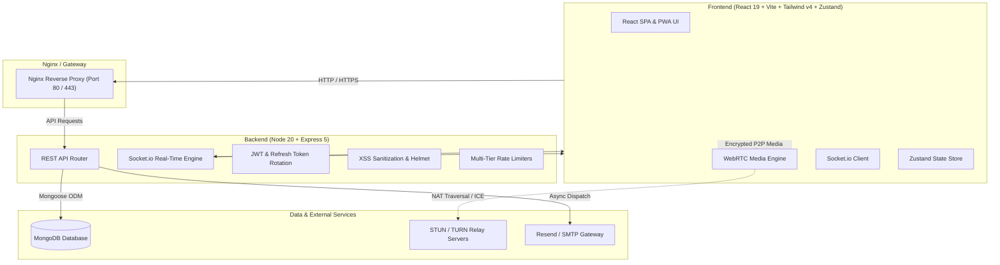

# ⚡ SkillSwap — Real-Time Peer-to-Peer Knowledge Exchange Platform

[](https://github.com/RAKESHKUSHWAHA7518/ProjectCom/actions/workflows/ci.yml)


> **SkillSwap** is a full-stack, distributed peer-to-peer mentoring and collaborative learning platform. It empowers users to discover mentors, schedule 1-on-1 sessions, conduct low-latency WebRTC video calls with screen sharing, communicate in real time via WebSockets, and participate in gamified learning challenges.

---

## 🏗️ System Architecture



---

## 💡 Key Engineering & Architectural Highlights

1. **Enterprise-Grade Authentication & Refresh Token Rotation (RTR)**:
   - Implements **single-use refresh token rotation** with automatic **reuse detection**.
   - If an expired or already-consumed refresh token is replayed, the entire token family is invalidated to prevent replay attacks.
   - HttpOnly, SameSite strict cookies for token transmission, eliminating client-side XSS token leakage.

2. **Property-Based Testing with `fast-check`**:
   - Rather than testing only happy-path unit tests, SkillSwap uses mathematical properties to test thousands of pseudo-random edge cases co-located with `mongodb-memory-server`:
     - Token expiry invariant ($t \ge \text{TTL}$ guaranteed rejected).
     - Refresh token chain integrity and reuse invalidation.
     - HTTP error status code mapping ($400 \le \text{code} \le 599$).
     - Input HTML sanitization invariants (stripping malicious tags & scripts).
     - Image optimizer dimension and aspect-ratio preservation within 1%.

3. **Peer-to-Peer WebRTC Video Calling with Resilient ICE Traversal**:
   - Browser-native WebRTC `RTCPeerConnection` with full-duplex audio, video, and screen sharing.
   - Socket.io signaling layer for SDP offer/answer negotiation and ICE candidate buffering.
   - Multi-server STUN + TURN relay fallback (`turn:openrelay.metered.ca`) ensuring connectivity behind restrictive NATs and symmetric firewalls.

4. **Multi-Layer Defensive Security**:
   - **XSS Prevention**: DOMPurify + JSDOM custom middleware sanitizing body, query, and path parameters on incoming requests.
   - **Strict CSP & Security Headers**: Helmet configured with fine-tuned Content Security Policy.
   - **Granular Rate Limiting**: Distinct burst and throttle limiters for authentication, search queries, avatar uploads, and chat messages.

5. **Mutual Skill Matchmaking Engine**:
   - Multi-factor scoring algorithm calculating mentor relevance:
     $$\text{Score} = \text{Direct Skill Match} + \text{Bidirectional Swap Bonus} + \text{Community Overlap} + \text{Reputation Weight}$$
   - Prioritizes mutually beneficial exchanges where each party can teach what the other seeks to learn.

---

## 🗄️ Tech Stack

| Domain | Technologies |
|---|---|
| **Frontend** | React 19, Vite, TailwindCSS v4, Zustand 5, Framer Motion, Lucide Icons, i18next |
| **Backend** | Node.js 20, Express 5, Mongoose 9, Socket.io 4, Sharp, Winston |
| **Database** | MongoDB 7 / MongoDB Atlas |
| **Testing** | Node Native Test Runner, Fast-Check (Property Testing), MongoDB Memory Server |
| **DevOps / Infra** | Docker, Docker Compose, Nginx, GitHub Actions CI/CD |

---

## 📦 Project Structure

```text
ProjectCom/
├── .github/
│   └── workflows/
│       └── ci.yml             # Automated CI pipeline (lint, test, build)
├── backend/
│   ├── __tests__/             # Unit and integration property tests
│   ├── config/                # Environment validation, DB, CORS, Helmet
│   ├── controllers/           # REST endpoint business logic
│   ├── middleware/            # Auth, rate limiting, sanitization, error handlers
│   ├── models/                # Mongoose database schemas
│   ├── routes/                # Express API routes
│   ├── services/              # Email & background services
│   ├── utils/                 # Winston logger, image optimizer
│   ├── server.js              # HTTP & WebSocket server entrypoint
│   └── Dockerfile             # Backend container image
├── frontend/
│   ├── src/
│   │   ├── components/        # Reusable UI components
│   │   ├── pages/             # Route views (Explore, Sessions, VideoCall, Admin)
│   │   ├── store/             # Zustand state stores
│   │   ├── utils/             # WebRTC & Socket.io client utilities
│   │   └── App.jsx            # Core routing & navigation
│   ├── nginx.conf             # Production Nginx reverse proxy config
│   └── Dockerfile             # Multi-stage frontend container build
├── docker-compose.yml         # Multi-container local orchestration
└── README.md                  # System documentation
```

---

## 🚀 Quickstart & Local Development

### Prerequisites
- Node.js 20+
- MongoDB 6+ (local or Atlas URI)
- npm or yarn

### 1. Clone the Repository
```bash
git clone https://github.com/RAKESHKUSHWAHA7518/ProjectCom.git
cd ProjectCom
```

### 2. Configure Environment Variables

**Backend (`backend/.env`):**
```env
PORT=5000
NODE_ENV=development
MONGO_URI=mongodb://localhost:27017/skillswap
JWT_SECRET=your_32_character_super_secret_jwt_key_here!
JWT_REFRESH_SECRET=your_32_character_super_secret_refresh_key_here!
ALLOWED_ORIGINS=http://localhost:5173,http://localhost:3000
EMAIL_HOST=smtp.example.com
EMAIL_PORT=587
EMAIL_USER=apikey
EMAIL_PASS=your_email_password
EMAIL_FROM=hello@skillexchange.fun
```

**Frontend (`frontend/.env`):**
```env
VITE_API_URL=http://localhost:5000/api
VITE_SOCKET_URL=http://localhost:5000
```

### 3. Install Dependencies & Run

**Backend:**
```bash
cd backend
npm install
npm run dev
```

**Frontend:**
```bash
cd frontend
npm install
npm run dev
```

Platform will be accessible at: `http://localhost:5173`.

---

## 🐳 Docker Compose Deployment

Spin up the entire stack (MongoDB, Node API backend, and Nginx-powered React client) with one command:

```bash
docker-compose up --build
```

- **Frontend App**: `http://localhost`
- **Backend API**: `http://localhost:5000/api`
- **Health Check**: `http://localhost:5000/api/health`

---

## 🧪 Running Automated Tests

SkillSwap includes comprehensive unit and integration suites with property-based tests:

```bash
# Run backend test suite with test coverage
cd backend
npm test

# Run frontend lint verification
cd frontend
npm run lint

# Run production build verification
cd frontend
npm run build
```

---

## 🛡️ Security & Quality Standards

- **Zero-Lint Guarantee**: Enforced by ESLint with zero warnings across frontend components.
- **Strict Content Security Policy**: Prevents untrusted scripts and clickjacking attacks.
- **Graceful Error Handling**: Centralized error middleware with standardized error formats and environment-specific stack traces.
